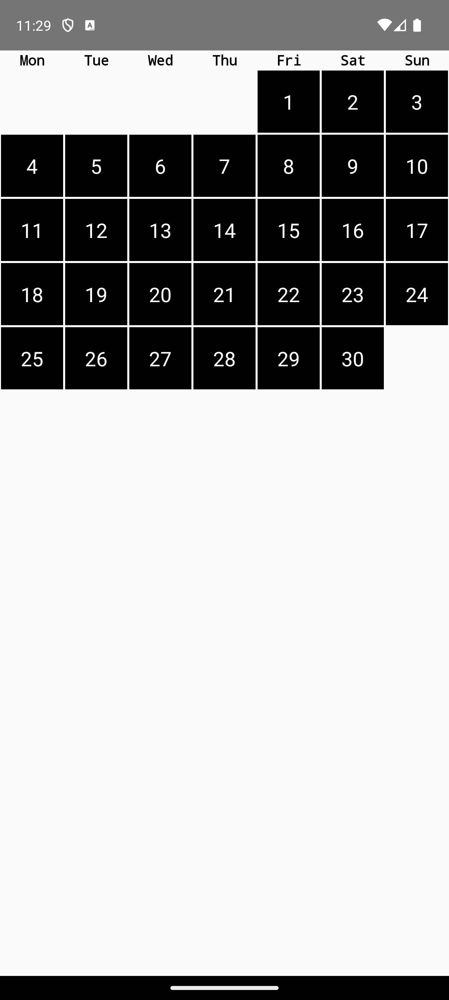
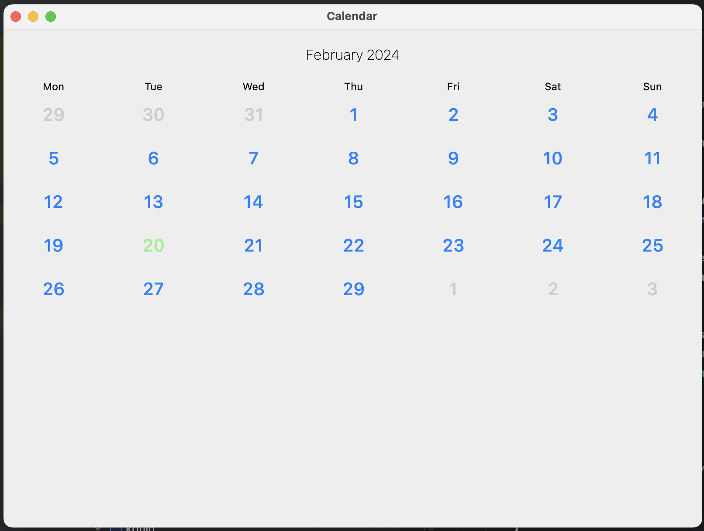
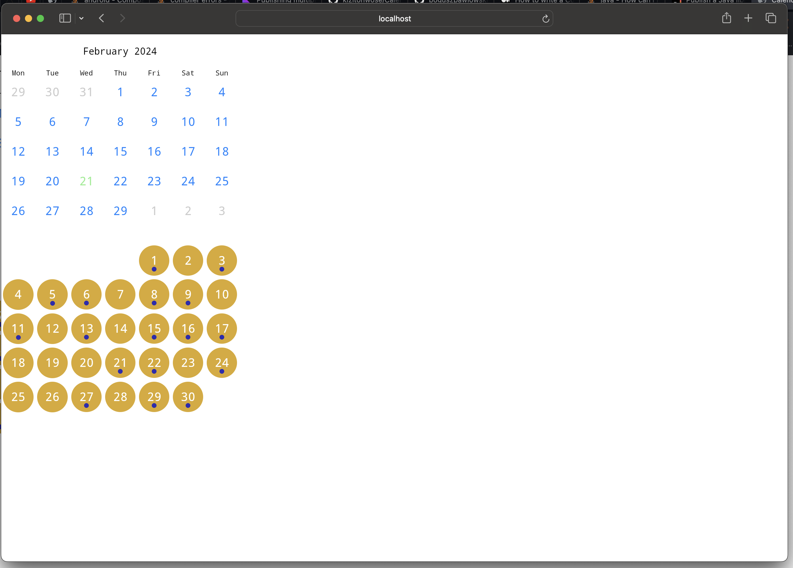

# Compose Multiplatform Calendar

Highly configurable Kotlin Multiplatform Compose library where you can easily draw
calendar picker for any platform you want: Android, iOS, Desktop or even Web!


Android sample:




Desktop sample:



Web sample:



# Platforms:

| Platform  | Supported |
|-----------|-----------|
| Android   | ✅         |
| iOS       | ✅         |
| Web(Wasm) | ✅         |
| Desktop   | ✅         |

# How to use:

1. Import library from Maven Central repository:

```
implementation("io.github.wojciechosak:calendar:0.0.1")
```

2. Basic view is CalendarView: 
```
    CalendarView(
        date = remember {
            Clock.System.now()
                .toLocalDateTime(TimeZone.currentSystemDefault()).date
        }
            .plus(monthOffset, DateTimeUnit.MONTH),
        day = { date, isToday, isForPreviousMonth, isForNextMonth ->
            CalendarDay(
                date = date,
                isToday = isToday,
                isForPreviousMonth = isForPreviousMonth,
                isForNextMonth = isForNextMonth,
                secondRowText = viewModel.getKcal(date),
                onClick = {

                }
            )
        },
        showWeekdays = true,
        showPreviousMonthDays = true,
        showNextMonthDays = true
    )
```

With `day` we can control view of single cell of day. You can use CalendarDay composable as
basic view. 

3. For scrollable view you can use `HorizontalCalendarView`:

```
HorizontalCalendarView { monthOffset ->
    CalendarView(
        date = remember {
            Clock.System.now()
                .toLocalDateTime(TimeZone.currentSystemDefault()).date
        }
            .plus(monthOffset, DateTimeUnit.MONTH),
    )
}
```

<image src="readme/sample2.webp" width="400">

4. You can style months name, day view or week label as you prefer, just pass them as composables to lib and it is done!
5. You can also use WeekView: 

```
val today = LocalDate(1995, monthNumber = 7, dayOfMonth = 4)
WeekView(
    date = today,
    minDate = LocalDate(1990, monthNumber = 1, dayOfMonth = 1),
    maxDate = LocalDate(2050, monthNumber = 12, dayOfMonth = 31),
)
```


# Sample project:

## Before running!
 - check your system with [KDoctor](https://github.com/Kotlin/kdoctor)
 - install JDK 17 on your machine
 - add `local.properties` file to the project root and set a path to Android SDK there

### Android
To run the application on android device/emulator:  
 - open project in Android Studio and run imported android run configuration

To build the application bundle:
 - run `./gradlew :sample:composeApp:assembleDebug`
 - find `.apk` file in `sample/composeApp/build/outputs/apk/debug/composeApp-debug.apk`

### Desktop
Run the desktop application: `./gradlew :sample:composeApp:run`

### iOS
To run the application on iPhone device/simulator:
 - Open `iosApp/iosApp.xcproject` in Xcode and run standard configuration
 - Or use [Kotlin Multiplatform Mobile plugin](https://plugins.jetbrains.com/plugin/14936-kotlin-multiplatform-mobile) for Android Studio

### Browser
Run the browser application: `./gradlew :sample:composeApp:jsBrowserDevelopmentRun`

