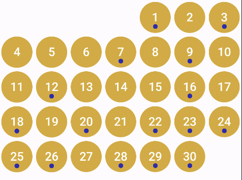

Thank you for your contributions and support. This library is no longer maintained. 
You can use kizitonwose/Calendar instead — it now supports Kotlin Multiplatform as well.

# Compose Multiplatform Calendar

<div style="text-align:center">
    
</div>

[[not(contains(text(),%27-%27))][last()])](https://repo1.maven.org/maven2/io/github/wojciechosak/calendar/)


Highly configurable Kotlin Multiplatform Compose library where you can easily draw
calendar picker for any platform you want: Android, iOS, Desktop or even Web!

**We give you logic, you define UI with Composables!**

---

<div style="text-align:center">
    
</div>
<div style="text-align:center">
    
</div>

Features:

|          Feature           | Supported |
|:--------------------------:|:---------:|
| Single month calendar view |     ✅     |
|       Week calendar        |     ✅     |
|    Horizontal calendar     |     ✅     |
|      Customizable UI       |     ✅     |
|      Headers support       |     ✅     |
|      Calendar offsets      |     ✅     |
|      Single selection      |     ✅     |
|     Multiple selection     |     ✅     |
|     Month/Year picker      |     ✅     |
|  Scroll to date animation  |     ✅     |
|     Vertical calendar      |     ✅     |
|      Range selection       |     ✅     |

You can test Web version here: [Web Demo](https://wojciechosak.github.io/Calendar/)
It is builded sample app and distributed by Github Pages.

---

# Setup

[[not(contains(text(),%27-%27))][last()])](https://repo1.maven.org/maven2/io/github/wojciechosak/calendar/)

In Android project: 

```groovy
dependencies {
  implementation 'io.github.wojciechosak:calendar:<latest-version>'
}
```

In Kotlin Multiplatform project:

```groovy
commonMain.dependencies {
  implementation 'io.github.wojciechosak:calendar:<latest-version>'
}
```

```kotlin
HorizontalCalendarView(startDate = startDate) { monthOffset ->
  CalendarView(
    config = rememberCalendarState(
      startDate = startDate,
      monthOffset = 0
    ),
    day = { dayState ->
      // define your day composable here!
    }
  )
}
```

Basic horizontal scrollable view:

```kotlin
HorizontalCalendarView(startDate = startDate) { monthOffset ->
  CalendarView(
    config = rememberCalendarState(
      startDate = startDate,
      monthOffset = monthOffset,
    ),
  )
}
```

# Documentation

Documentation can be found here: [docs.md](docs.md)

# Composables

<details>
  <summary>List of available views</summary>

Simply use in Compose any view you want: 

|   View type    |                      Preview                       |
|:--------------:|:--------------------------------------------------:|
|  CalendarView  |  |
| HorizontalView |     |
|  VerticalView  |       |
|    WeekView    |       |
|  MonthPicker   |    |
|   YearPicker   |     |

Each view get as parameter day cell composable. Thanks to that your calendar can look whatever you like:



</details>

# Versions


| Compose version |   Library version    |
|:---------------:|:--------------------:|
|     1.5.11      | 0.0.8-compose-1.5.11 |
|      1.6.1      |        0.0.9         |
|     1.6.10      |        1.0.0         |
|     1.6.10      |        1.0.1         |
|      1.7.0      |        1.0.2         |

--- 

# Samples:

In directory sample you can find bunch of examples. You can run Android/iOS application and test it 
yourself. Below you can find instruction how to run sample project on your computer.

<details>
  <summary>Sample project</summary>

## Before running!

- check your system with [KDoctor](https://github.com/Kotlin/kdoctor)
- install JDK 17 on your machine

### Android

To run the application on android device/emulator:

- open project in Android Studio and run imported android run configuration

To build the application bundle:

- run `./gradlew :sample:composeApp:assembleDebug`
- find `.apk` file in `sample/composeApp/build/outputs/apk/debug/composeApp-debug.apk`

### Desktop

Run the desktop application: `./gradlew :sample:composeApp:run`

### iOS

To run the application on iPhone device/simulator:

- Open `iosApp/iosApp.xcproject` in Xcode and run standard configuration
- In XCode open Build Phases -> Run Script -> paste script:

```
    cd "$SRCROOT/../../"
    ./gradlew :sample:composeApp:embedAndSignAppleFrameworkForXcode
```

And build the project.

- After that you can
  use [Kotlin Multiplatform Mobile plugin](https://plugins.jetbrains.com/plugin/14936-kotlin-multiplatform-mobile)
  for Android Studio

### Browser

Run the browser application: `./gradlew :sample:composeApp:jsBrowserDevelopmentRun`
</details>
