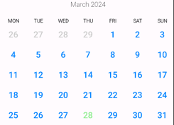
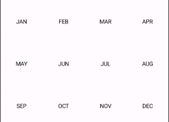
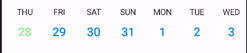
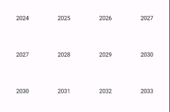
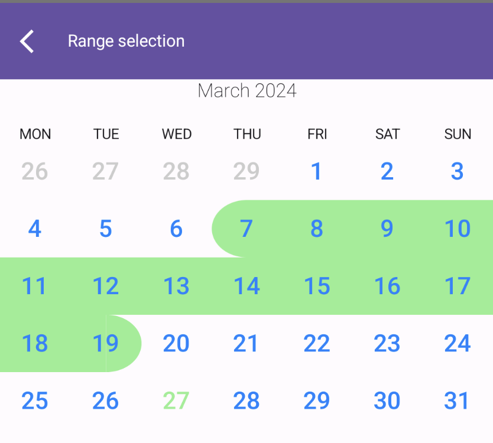

# Composable Functions Documentation

## HorizontalCalendarView

Composable function to display a horizontal calendar view.

### Parameters:

- `startDate`: The start date of the calendar.
- `pagerState`: The PagerState used to control the horizontal paging behavior of the calendar.
- `modifier`: The modifier for styling and layout of the calendar.
- `pageSize`: The size of each page in the calendar. Default is `PageSize.Fill`.
- `beyondBoundsPageCount`: The number of pages to keep loaded beyond the visible bounds. Default is
  1.
- `contentPadding`: The padding applied around the content of the calendar.
- `calendarAnimator`: The animator used for animating calendar transitions.
- `calendarView`: The composable function to display the content of each calendar page.



## MonthPicker

Composable function to display a month picker with selectable months.

### Parameters:

- `columns`: The number of columns in the grid layout of the month picker. Default is 4.
- `horizontalArrangement`: The horizontal alignment of items in the grid layout. Default
  is `Alignment.CenterHorizontally`.
- `verticalArrangement`: The vertical arrangement of items in the grid layout. Default
  is `Arrangement.Center`.
- `modifier`: The modifier for styling and layout of the month picker.
- `userScrollEnabled`: Whether scrolling is enabled for the month picker. Default is true.
- `monthCount`: The total number of months to display in the picker. Default is 12.
- `onMonthSelected`: The callback invoked when a month is selected.
- `monthView`: The composable function to display each month item in the picker.



## VerticalCalendarView

Composable function to display a vertical calendar view.

### Parameters:

- `startDate`: The start date of the calendar.
- `calendarAnimator`: The animator used for animating calendar transitions.
- `modifier`: The modifier for styling and layout of the calendar.
- `pageSize`: The size of each page in the calendar. Default is `PageSize.Fill`.
- `contentPadding`: The padding applied around the content of the calendar.
- `beyondBoundsPageCount`: The number of pages to keep loaded beyond the visible bounds. Default is
  1
- `calendarView`: The composable function to display the content of each calendar page.

## WeekView

Composable function to display a week view with selectable days.

### Parameters:

- `startDate`: The start date of the week view. Default is the current date.
- `minDate`: The minimum selectable date in the week view. Default is three months before the start
  date.
- `maxDate`: The maximum selectable date in the week view. Default is three months after the end
  date of the month containing the start date.
- `daysOffset`: The offset in days from the start date. Default is 0.
- `showDaysBesideRange`: Whether to show days beside the range. Default is true.
- `calendarAnimator`: The animator used for animating calendar transitions.
- `isActive`: A lambda function to determine if a date is considered active. Default is comparison
  with the current date.
- `modifier`: The modifier for styling and layout of the week view.
- `firstVisibleDate`: A callback invoked with the first visible date in the week view.
- `day`: The composable function to display each day item in the week view.

### Code: 

```kotlin
 WeekView { state ->
  Column(horizontalAlignment = Alignment.CenterHorizontally) {
    Text(state.date.daySimpleName())
    CalendarDay(
      state,
      onClick = { },
    )
  }
}

```



## YearPicker

Composable function to display a year picker with selectable years.

### Parameters:

- `columns`: The number of columns in the grid layout of the year picker. Default is 4.
- `rows`: The number of rows in the grid layout of the year picker. Default is 3.
- `startDate`: The start date of the year picker. Default is the current date.
- `mode`: The mode of the year picker. Default is `YearPickerMode.HORIZONTAL`.
- `yearOffset`: The offset in years from the start date. Default is 0.
- `modifier`: The modifier for styling and layout of the year picker.
- `pageSize`: The size of each page in the year picker. Default is `PageSize.Fill`.
- `onYearSelected`: The callback invoked when a year is selected.
- `yearView`: The composable function to display each year item in the picker.

### Code: 

```kotlin
YearPicker(
  onYearSelected = {
    date = date.copy(year = it)
    mode = DatePickerMode.DAY
  },
)
```



## Range selection:

```kotlin
CalendarView(
    config = rememberCalendarState(
        startDate = startDate,
        monthOffset = monthOffset,
    ),
    selectionMode = SelectionMode.Range,
    rangeConfig = RangeConfig(rangeIllustrator = RoundedRangeIllustrator(Pallete.LightGreen)),
)
```

  

You can draw yourself implementations of RangeIllustrator, or use
predefined `RoundedRangeIllustrator`
and `UnderlineIllustrator`.

## Selection callbacks:

```kotlin
CalendarView(
    config = ...,
onDateSelected = { date ->
    // date: List<LocalDate> <--- selected dates
},
selectionMode = SelectionMode.Multiply(3) // SelectionMode.Single or SelectionMode.Range
)
```

`onDateSelected()` will return: 
- SelectionMode.Single - one element list 
- SelectionMode.Multiply(N) - N elements list 
- SelectionMode.Range - two elements list where first item is older than second item

## Animations:

You can animate calendar to scroll to desired date.

```kotlin
val startDate by remember { mutableStateOf(LocalDate.today()) }
val calendarAnimator by remember { mutableStateOf(CalendarAnimator(startDate)) }
val coroutineScope = rememberCoroutineScope()

HorizontalCalendarView(
  startDate = startDate,
  calendarAnimator = calendarAnimator,
)

// to scroll after click on button:
Button(onClick = {
  coroutineScope.launch {
    calendarAnimator.animateTo(LocalDate(1995, Month.NOVEMBER, 12))
  }
}) {
  Text("Animate!")
}
```

CalendarAnimator provides also pager methods like:

```kotlin
animateToNextPage()
animateToPreviousPage()
scrollToPage(page: Int, pageOffsetFraction: Float = 0f)
```
